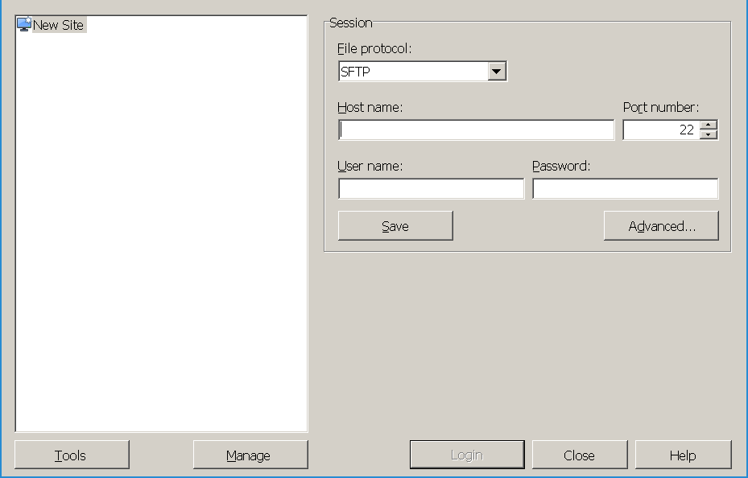
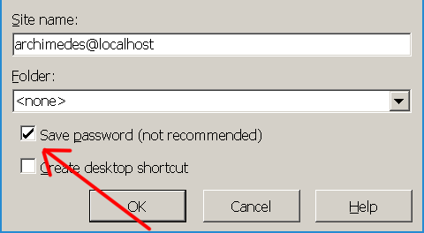
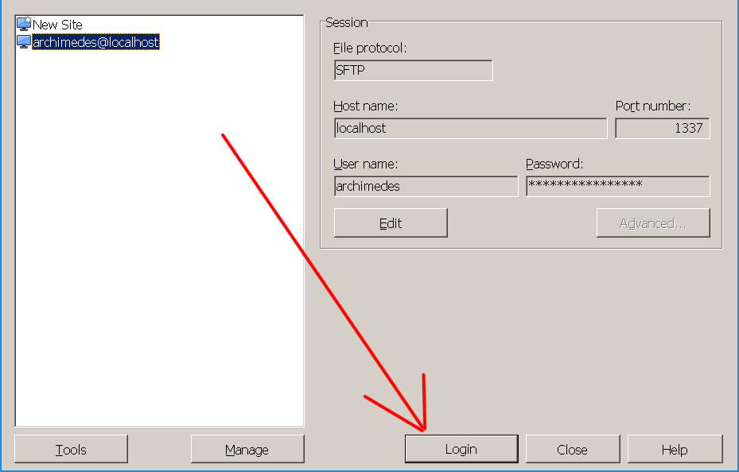
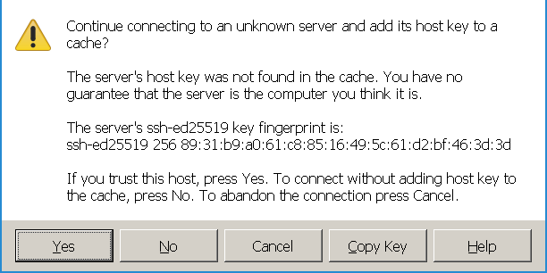
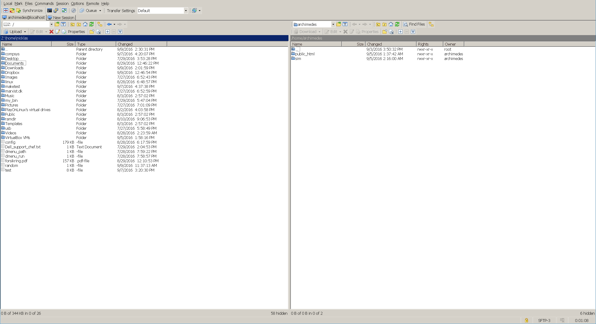

# Windows tools -- Roll Your Own Toolchain

## Windows Subsystem for Linux (WSL)
We strongly recommend that you are using a 64-bit Windows 10. That way you can in most cases avoid the virtual machine and run native Linux command-line tools directly on Windows. This means you can use your own Windows files and don't have to bother transferring files to a virtual machine.

To install Windows Subsystem for Linux, [click here for Microsoft's own instructions](https://docs.microsoft.com/en-us/windows/wsl/install-win10).

## Virtual machine
If you are using another version of Windows, prefer virtual machines or experience issues with WSL, follow the below instructions for setting up a virtual machine.

Content:
* Installing WinSCP
* Connecting and transfer files from windows to the virtual machine through SSH. You can also do this connection though WSL, in which you should follow the general VM manual.

WinSCP is a open source SCP client for windows, which we will use to transfer files between your Windows computer and the virtual Linux machine.

### Installation
Go to [https://winscp.net/eng/download.php](https://winscp.net/eng/download.php)and download either the installation package or the portable executable.
The installation package should be installed as any other Windows program, and the portable executable can just be unzipped to any location.

### Connecting to the virtual machine with WinSCP
Make sure that the virtual machine is started and fully booted, then run WinSCP.

The first time you start WinSCP, the window depicted in the screenshot below should open.

Fill the fields with the following values:

  * **Host name:**  localhost
  * **Port number** 1337
  * **User name:**  neumann
  * **Password:**   hamster

Press "Save", check the "Save password" checkbox as depicted in the screenshot below, and press "OK":

You should now be able to login by selecting the [archimedes@localhost](mailto:archimedes@localhost%22) in the left side and pressing the "Login" button, as depicted in the screenshot below:

The first time you do this, you will probably be met with the following warning:

Just press "Yes" and the connection should succeed.

When the connection is established, you should have a window similar to the screenshot below:

The left side is your local files on you Windows computer, and the right side is the virtual machine. By dragging and dropping files/directories from the left side to the right side, or the right side to the left side, you can transfer files from your Windows computer to the virtual machine and transfer files from the virtual machine to your Windows computer respectively.
